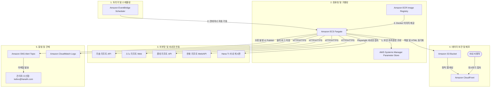

# resort-availability-automation
## AWS 클라우드 이관 시스템 아키텍처 및 유지보수 가이드 (MAINTENANCE)

본 문서는 리조트 잔여 객실 수집 및 사내 게시판 자동화 프로그램의 AWS ECS Fargate 클라우드 마이그레이션 결과물에 대한 시스템 구조 및 사후 유지보수 지침서입니다.

---

## 1. 시스템 아키텍처 (System Architecture)

본 시스템은 서버를 상시 가동하지 않고, 정해진 시간대에만 컨테이너를 가동하여 자원을 절약하는 **서버리스(Serverless) 스케줄링 아키텍처**를 채택하고 있습니다.



---

## 2. 수집 및 반영 파이프라인 프로세스 (Pipeline Flow)

스케줄러에 의해 ECS Fargate 태스크가 기동되면 아래 순서로 프로세스가 진행됩니다.

```
[Fargate 기동]
      │
      ▼
1단계: AWS Parameter Store에서 ID/PW를 주입받아 임시 .env 파일 동적 생성
      │
      ▼
2단계: 4대 리조트(리솜, 소노, 롯데, 한화) 크롤러 순차 실행
      * 한화리조트는 로그인 팝업 WAF 회피용 JS 강제 클릭 적용
      * 롯데리조트는 API 24개 고속 병렬 호출 적용 (속도 3.3배 단축)
      * 개별 리조트 수집 실패 시 즉시 관리자 이메일 발송 후 다음 리조트 계속 진행
      │
      ▼
3단계: 수집된 엑셀 데이터를 병합하여 resort_availability.html (유리 디자인 대시보드) 생성
      │
      ▼
4단계: RAG 전용 표준 텍스트 데이터 (.txt) 변환 및 생성
      │
      ▼
5단계: 사내 게시판 자동화 스크립트 실행 (board_automation/update_board.py)
      * Playwright를 통해 사내 게시판(dhr.hanati.co.kr)에 접속하여 12개 본문 글 자동 수정
      │
      ▼
6단계: 빌드된 HTML 및 수집 엑셀 원본, RAG 텍스트 파일들을 AWS S3로 동기화(aws s3 sync)
      │
      ▼
[Fargate 종료 (자동 꺼짐)] -> 과금 중단
```

---

## 3. 핵심 유지보수 가이드 (가장 중요)

### 🔑 3개월 주기 패스워드 변경 시 조치 방법 (Password Rotation)
리조트사 사이트 및 사내 인사시스템의 패스워드 주기 변경 창이 떠서 정보를 변경하셨을 경우, **소스코드를 건드릴 필요 없이 AWS 웹 화면에서 값만 바꾸어 주시면 됩니다.**

1. [AWS 웹 콘솔](https://console.aws.amazon.com) 로그인
2. 상단 검색창에 **`Parameter Store`** 검색 후 클릭 진입
3. 목록에서 수정하고자 하는 파라미터 클릭:
   * **사내 게시판 계정**:
     * `/resort-automation/prod/board/BOARD_ID` (아이디)
     * `/resort-automation/prod/board/BOARD_PASSWORD` (비밀번호)
   * **리조트 계정**:
     * `/resort-automation/prod/resort/HANHWA_ID` / `HANHWA_PW` / `HANHWA_MEMBERSHIP_PW` (한화 2차비번)
     * `/resort-automation/prod/resort/DAEMYUNG_ID` / `DAEMYUNG_PW` (소노)
     * `/resort-automation/prod/resort/LOTTE_ID` / `LOTTE_PW` (롯데)
     * `/resort-automation/prod/resort/RESOM_ID` / `RESOM_PW` (리솜)
4. 우측 상단의 **`[편집] (Edit)`** 버튼 클릭
5. **값(Value)** 입력란에 새로 변경된 패스워드를 기입
6. **`[변경 사항 저장] (Save changes)`** 클릭

---

## 4. 소스코드 수정 및 재배포 방법 (CI/CD)

크롤링 로직이나 화면 디자인을 수정하여 클라우드에 다시 반영하고자 할 때의 절차입니다. 본 프로젝트는 **GitHub Actions를 통해 도커 빌드가 자동화**되어 있습니다.

1. 로컬 PC의 프로젝트 폴더(`d:\휴양소`) 내 소스코드 수정
2. 수정한 소스코드 커밋 및 깃허브 푸시:
   ```bash
   git add .
   git commit -m "수정 메시지 입력"
   git push origin main
   ```
3. 푸시가 발생하면 **GitHub Actions**가 트리거되어 자동으로 새로운 Docker 이미지를 빌드하고 AWS ECR 이미지 저장소에 `latest` 태그로 덮어쓰기 업로드합니다. (소요 시간 약 2~4분)
4. 다음 스케줄 가동 시 변경된 새로운 이미지가 자동으로 내려받아져 실행됩니다.

---

## 5. 장애 대응 및 관제 (Troubleshooting)

### 📧 에러 알림 이메일 수신 시 대응
* 수집 또는 게시판 업로드에 오류가 발생하면 즉시 **`kelixx@hanafn.com`** 주소로 `[경보] 휴양소/메뉴 수집 및 자동 업데이트 작업 실패 (...)` 이메일이 발송됩니다.
* 메일 내용에 기재된 실패 지점(한화 크롤러, 사내 게시판 자동 수정기 등)을 파악합니다.

### 📝 원인 분석을 위한 실시간 로그 조회 (CloudWatch)
* 상세 에러 추적(Python Traceback)을 위해 AWS 로그 시스템에서 상세 에러를 진단할 수 있습니다.
1. AWS 콘솔에서 **`CloudWatch`** 서비스 접속
2. 왼쪽 메뉴 **`[로그 그룹] (Log groups)`** 선택 ➡️ **`/ecs/resort-automation-prod`** 클릭
3. 가장 최근의 **로그 스트림**을 선택하여 상세 에러 내역을 확인하고 조치합니다.

---

## 6. GitHub 워크플로우 관리 및 동기화 모델 (CI/CD Details)

프로젝트 내에 배치된 GitHub Actions 설정 파일들의 역할과 비활성화 방식, 그리고 로컬/아마존 간의 동기화 구조에 대한 설명입니다.

### 📁 워크플로우 파일별 역할
* **`.github/workflows/deploy_to_aws.yml`**
  * **주요 역할**: AWS 배포 자동화 액션입니다.
  * **동작**: 개발자가 코드를 수정하여 `main` 브랜치에 푸시(`git push`)하면, 깃허브 빌드 서버가 자동으로 코드를 받아 Docker 이미지를 생성하고 `AWS ECR`로 업로드해 주는 배포 파이프라인입니다.
* **`backup_workflows/auto_crawl.yml`** (백업 보관)
  * **주요 역할**: 기존에 깃허브 자체 서버에서 크롤러를 스케줄러로 돌릴 때 쓰던 과거 수집용 설정 파일입니다.
  * **중단 조치**: AWS 이관 완료에 따라 깃허브에서의 중복 수집 및 해외 IP 차단 에러를 예방하기 위해, 실행 경로 바깥인 `backup_workflows/` 폴더로 이동하여 백업했습니다.
  * **참고**: 깃허브 액션은 `.github/workflows/` 내의 파일만 읽기 때문에, 이처럼 바깥 폴더로 보관해 두면 웹 UI 상에서 별도로 끄지 않아도 **자동으로 스케줄러가 중단(Pause)**됩니다. 추후 필요 시 폴더만 원래 위치로 되돌리면 가동할 수 있습니다.

### 🔄 AI를 통한 소스코드 원클릭 동기화 메커니즘
본 대화방에서 소스코드나 기능을 수정해 달라고 요청할 경우, 시스템은 다음과 같이 4단계로 연동되어 자동으로 갱신됩니다:
1. **로컬 수정**: AI 에이전트가 로컬 PC의 `D:\휴양소` 내 소스코드를 직접 수정합니다.
2. **원격 백업**: 수정이 완료되면 AI 에이전트가 로컬 PC의 깃 명령어를 사용하여 GitHub 원격 저장소로 코드(`git push`)를 업로드합니다.
3. **도커 빌드**: 깃허브가 푸시를 감지하고 `deploy_to_aws.yml`을 작동시켜 AWS ECR 저장소의 최신 이미지를 빌드 및 갱신합니다.
4. **AWS 실행**: 예약된 시각에 AWS Fargate가 기동될 때 새로 갱신된 이미지를 내려받아 동작하므로, 개발자는 소스코드 수정 요청 한 번만으로 최종 클라우드 반영까지 자동으로 완료됩니다.
