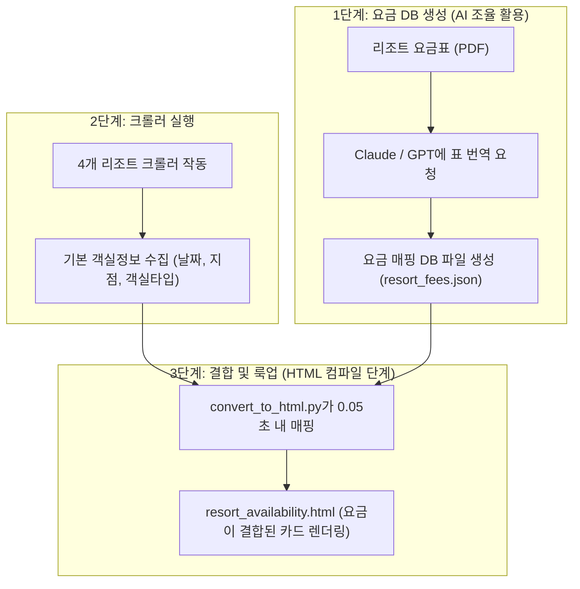

# 📄 리조트 요금 대시보드 연동 분석 및 연동 가이드 (PoC 용)

본 문서는 리조트 예약 현황 대시보드 구축 PoC(개념 검증) 이후, 임직원의 요구에 따라 **각 리조트별 회원 우대가 요금 정보를 화면에 연동할 때** 즉시 꺼내어 사용할 수 있도록 지금까지 분석된 요금 데이터 구조 및 최적의 구현 설계 방안을 정리한 문서입니다.

---

## 🔍 1. 요금표 파일 분석 결과 (OCR 불필요 검증 완료)

제공된 `D:\휴양소\요금표` 내의 롯데, 리솜, 소노 리조트의 PDF 요금안내서들은 모두 스캔한 이미지 파일이 아닌 **글자가 그대로 드래그되는 디지털 벡터 PDF** 형식입니다.
* **결론**: **OCR(이미지 글자 인식) 엔진이나 유료 API를 도입할 필요가 전혀 없습니다.** 
* 파이썬의 무료 PDF 파싱 라이브러리(`pypdf`, `pdfplumber` 등)를 통해 비용 없이 텍스트 데이터를 100% 정상 추출할 수 있습니다.

### 📁 브랜드별 요금표 분석 현황
1. **한화리조트 (`2026년_회원요금표.xlsx`)**
   - **구조**: `연간시즌표`, `회원요금기준▶`, `월별 요금 시트(3월~8월 무기명)`로 구성.
   - **특징**: 한화 리조트는 주기별로 3~6개월 단위 요금표만 엑셀로 제공하므로, 약 3개월 단위로 사내 자료실에서 최신 엑셀을 내려받아 폴더에 교체(덮어쓰기)해주어야 합니다.
2. **롯데리조트 (`2026년 객실 요금표_김해.pdf` 등)**
   - **구조**: 상반기/하반기/여름성수기 시즌 구간별로 주중, 금요일, 토요일 요금이 기명/무기명/준회원 등급별로 표 형태로 작성됨.
3. **리솜리조트 (`2026년 객실이용요금표.pdf`)**
   - **구조**: 준성수기/성수기/극성수기 시즌별로 기명, 무기명, 회원초청, 업그레이드 요금이 표 형태로 작성됨.
4. **소노리조트 (`2026년 소노리조트_회원요금표.pdf`)**
   - **구조**: 일반요금, 주중, 금요일, 토요일, 성수기 시즌별로 회원(기명), 회원(무기명), 회원초청 요금이 리조트별/평형별로 총 10페이지가 넘는 문서에 상세히 작성됨.

---

## 🚧 2. 실시간 PDF 파싱 구현 시의 한계점 (매핑 복잡성)

PDF에서 텍스트를 즉시 추출할 수는 있으나, 파이썬 코드가 매번 실시간으로 PDF를 해석하게 만들 경우 아래와 같은 복잡성이 발생하여 시스템이 불안정해질 수 있습니다.

1. **테이블 레이아웃 유실**: PDF에서 텍스트를 추출하면 표(Grid)의 가로줄 결합이 깨지고 모든 숫자가 세로로 흘러내려 들어옵니다. (어떤 숫자가 어떤 방의 요금인지 매핑하기 위한 엄격한 위치 분석 코드가 필요함).
2. **다차원 요금 필터**: 요금은 날짜의 요일(`주중/금/토`)과 날짜의 시즌(`비수기/준성수기/성수기/극성수기`)에 따라 다차원으로 분류됩니다.
3. **지점 및 객실 명칭 매칭**: 크롤러가 수집한 지점명/객실명(예: `스플라스 덕산`, `G40 스테이`)과 요금표상 지점명/객실명(예: `덕산`, `G40 스테이 (콘도)`)이 달라 **명칭 동의어 사전(Alias Mapping)**을 구축해야 합니다.

---

## 💡 3. 가장 효율적인 구현 아키텍처 제안: [정적 DB 매핑 + 룩업]

요금표와 리조트별 연간 시즌 캘린더는 **1년에 단 한 번(혹은 한화처럼 분기별 1회) 갱신되는 정적(Static) 데이터**입니다. 매번 크롤링할 때마다 PDF를 무겁게 읽는 대신, **요금 데이터베이스 파일(`resort_fees.json`)을 최초 1회 생성해 두고 룩업 매핑하는 방식**이 가장 이상적입니다.

### 🛠️ 전체 시스템 구조도



### 📂 매핑 DB (`resort_fees.json`) 설계 구조 예시
```json
{
  "seasons": {
    "리솜": {
      "20260725": "극성수기 주말",
      "20260726": "극성수기 주중"
    }
  },
  "fees": {
    "리솜": {
      "포레스트 제천": {
        "G40 빌라": {
          "기명_비수기주중": 148000,
          "무기명_비수기주중": 158000,
          "무기명_성수기주말": 258000
        }
      }
    }
  }
}
```

### 💻 컴파일러 룩업 로직 구현 가이드 (Python 예시)
`convert_to_html.py` 파일의 데이터 결합 단계에서 아래와 같은 간단한 함수만 연동해 주면 시스템 부하 없이 요금이 완벽히 매핑됩니다.

```python
import json
from datetime import datetime

# 1. 요금 DB 로드
with open("resort_fees.json", "r", encoding="utf-8") as f:
    fee_db = json.load(f)

def lookup_fee(brand, resort_name, room_type, date_str, member_type="무기명"):
    """
    brand: '리솜', '한화', '소노', '롯데'
    date_str: '20260725' 형식
    member_type: 회사가 보유한 회원권 정보에 따라 '기명' 또는 '무기명' 지정
    """
    try:
        # 날짜를 기준으로 해당 브랜드의 시즌 등급 조회
        season_type = fee_db["seasons"].get(brand, {}).get(date_str)
        if not season_type:
            # 시즌 정보가 없는 경우 요일별 기본값 지정
            dt = datetime.strptime(date_str, "%Y%m%d")
            weekday = dt.weekday() # 4=금, 5=토
            season_type = "주말" if weekday in [4, 5] else "주중"
            
        # 요금표 룩업 키 조합 (예: "무기명_성수기주말")
        fee_key = f"{member_type}_{season_type}"
        
        # 요금 매핑 테이블에서 매칭되는 가격 조회
        price = fee_db["fees"].get(brand, {}).get(resort_name, {}).get(room_type, {}).get(fee_key, 0)
        return price
    except Exception:
        return 0
```

---

## 📈 4. 향후 기능 활성화 시 액션 플랜

PoC 기간을 마친 후 임직원의 니즈가 생겨 요금 기능을 다시 켜고자 할 때는 아래 절차를 밟으시면 됩니다.

1. **한화 엑셀 파서 추가**:
   - `convert_to_html.py`에 `2026년_회원요금표.xlsx` 파일을 판다스로 바로 읽어와 날짜별 요금을 일회성으로 추출·결합하는 로직을 우선 추가합니다. (엑셀 파일만 교체해주면 주기적 연동 가능).
2. **롯데, 리솜, 소노 요금 DB화**:
   - 요금표 PDF의 텍스트를 복사하여 Claude에 전달하고, 상기 제시된 `resort_fees.json` 규격에 맞는 JSON 형식으로 변환해 달라고 하여 DB 파일을 저장합니다.
3. **매핑 사전(Alias Map) 튜닝**:
   - 객실명이나 지점명이 일치하지 않아 요금이 `0`으로 표시되는 케이스를 검출하여 `G40 스테이` -> `G40` 형태로 사전을 다듬어 줍니다.
4. **HTML 대시보드 렌더링 복구**:
   - `convert_to_html.py` 내부의 Javascript 영역에서 주석 해제된 `${priceRow}` 렌더링 코드를 활성화합니다.
