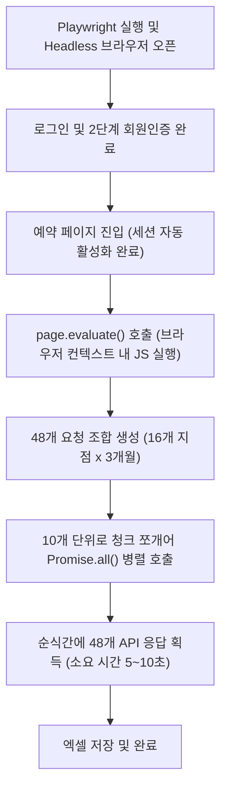

# 📄 한화리조트 API 수집 구조 분석 및 Playwright 고도화 제안서

본 문서는 현재 한화리조트 객실 수집기(`hanwha_resort_crawler_v14.py`)가 타사(리솜, 소노 등)처럼 **Playwright + 초고속 API 백그라운드 병렬 수집 방식**으로 즉시 연동되지 못하고 **Selenium 기반의 물리적 순차 조작 방식**에 머물러 있는 기술적 요인을 분석하고, 향후 시스템 고도화 시 참고할 수 있는 리팩토링 설계 로드맵을 제공합니다.

---

## 🔍 1. 기술적 장애 요인 분석 (API 직접 호출이 어려운 이유)

한화리조트의 예약 서비스는 타사 대비 보안 정책 및 세션 관리 구조가 매우 보수적이고 난해하게 설계되어 있어, 일반적인 백그라운드 API 호출 모사(Mocking)에 진입 장벽이 존재합니다.

### ① 다중 도메인 간 교차 세션(SSO) 제어의 난해함
* **로그인 도메인**: `www.hanwharesort.co.kr` (공식 홈페이지 및 통합 SSO 로그인 서버)
* **예약 도메인**: `booking.hanwharesort.co.kr` (실질적인 예약 및 API 호출 서버)
* **장애 요인**: 사용자가 로그인을 완료하면 두 도메인 간에 복잡한 리다이렉션 과정을 거치며 세션 쿠키와 인증 토큰을 동기화합니다. 브라우저 없이 파이썬 `requests` 등으로 이를 처리하려면 쿠키 발급 정책과 도메인 교차 세션 헤더 조립을 수동으로 완벽하게 모사해야 하며, 이는 보안 패치 시 쉽게 깨지는 원인이 됩니다.

### ② 2단계 비밀번호(회원권 인증) 세션 바인딩
* 한화 리조트는 로그인 후 예약을 진행하기 위해 **회원권 비밀번호**를 추가로 입력해야 하는 2단계 인증 구조를 갖추고 있습니다.
* 이 단계에서 특정 난독화된 암호화 알고리즘을 거친 인증 패킷이 전송되며, 이 세션이 예약 서버 단에 활성화(바인딩)되어 있어야만 잔여 객실 검색 API가 정상 작동합니다. 
* 단순 로그인 쿠키만 가지고 API를 바로 찌르면 `"권한이 없습니다"` 또는 `"2단계 인증이 필요합니다"` 에러가 반환됩니다.

### ③ API 요청 패킷 내 동적 토큰 및 헤더 검증
* 잔여 객실 조회 엔드포인트(`/rst/rrs/0010/doExecute.mvc`)는 보안 강화를 위해 매번 동적으로 변하는 고유의 해시 키값(CSRF 방지 토큰 및 브라우저 식별 정보)을 요청 파라미터나 HTTP 헤더에 요구합니다.
* 이 값들의 생성 공식이 리조트 웹페이지 내부의 자바스크립트 엔진에 꽁꽁 묶여 있기 때문에, 진짜 크롬 브라우저 환경이 뒷받침되지 않으면 헤더 값을 위조하기 어렵습니다.

---

## 🛠️ 2. 기존 Selenium 수집기의 구현 타협점

과거 개발팀은 위의 기술적 난제들을 해결하기 위해 다음과 같은 방식으로 작동하는 크롤러를 구성했습니다.

1. **로그인 및 세션 브라우저 위임**: 2단계 로그인 및 쿠키 관리는 컴퓨터가 진짜 크롬 창(Selenium Headless)을 띄워 브라우저 엔진에 통째로 위임했습니다.
2. **동작 시뮬레이션**: 암호화 헤더와 CSRF 토큰 우회를 위해, 화면에 있는 16개 지점 탭을 마우스로 직접 클릭하고 검색 버튼(`calSch`)을 물리적으로 클릭하도록 짰습니다.
3. **네트워크 인터셉트(CDP) 절충안**: 화면의 HTML 요소를 읽어오기에는 달력 구조가 너무 복잡하므로, 크롬의 성능 로그(`Performance Logs`)를 덤프하여 백그라운드로 전송된 `doExecute.mvc` 응답 본문(JSON)만 낚아채는(Intercept) 절충안을 택했습니다.
* **한계**: 클릭 인터랙션마다 브라우저가 화면을 갱신하는 물리적인 시간을 기다려야 하므로, 매 루프마다 `time.sleep(3.5)`를 주어 **총 5분 가량의 수집 대기 시간**이 발생하는 병목이 생기게 되었습니다.

---

## 🚀 3. 향후 고도화 방안 (Playwright API 방식으로의 리팩토링 로드맵)

향후 이 한화 크롤러의 수집 시간을 **4~5분에서 20초 이내**로 획득 성능을 단축하고자 할 때 취해야 할 고도화 설계 방안입니다.

### 💡 핵심 컨셉: [브라우저 로그인 획득 + 브라우저 내부 백그라운드 병렬 fetch]

셀레니움처럼 16개 리조트 탭을 48번 클릭하는 대신, **Playwright 브라우저 내부에서 로그인 세션이 유지된 컨텍스트를 활용하여 비동기 fetch를 한 번에 쏘는 방식**입니다.



### 💻 2단계: 핵심 자바스크립트 병렬 fetch 코드 예시
Playwright의 `page.evaluate()` 기능을 사용하여, 브라우저가 로그인된 상태의 메모리를 공유하며 아래와 같은 자바스크립트를 브라우저 안에서 실행하게 만듭니다. 이렇게 하면 복잡한 암호화 헤더와 쿠키 전송을 브라우저가 자동으로 짊어지고 가기 때문에 분석 비용 없이 초고속 병렬 수집이 가능해집니다.

```python
# Playwright 내에서 실행할 초고속 API 수집 파이썬 코드 예시
def collect_hanwha_fast(page, target_resorts, months):
    """
    page: Playwright의 Page 객체 (로그인이 완료된 상태)
    target_resorts: 수집할 리조트 이름 리스트
    months: 수집할 연월 리스트 (예: ['202603', '202604', '202605'])
    """
    
    # 1. 예약 페이지로 이동하여 브라우저의 기본 세션 및 쿠키 장착 상태 보장
    page.goto("https://booking.hanwharesort.co.kr/rst/rrs/0010/serviceM00.mvc")
    page.wait_for_load_state("networkidle")
    
    # 2. 브라우저 컨텍스트 내부에서 API 병렬 fetch를 직접 수행하는 JS 코드 주입
    js_code = """
    async function fetchHanhwaAPI(resorts, months) {
        // 예약 페이지에 존재하는 기존 공통 폼과 파라미터를 그대로 재사용
        const formEl = document.getElementById('searchForm') || document.querySelector('form');
        const results = [];
        
        // 16개 리조트 x 3개월 분량의 요청 파라미터 조합 생성
        const tasks = [];
        for (const resort of resorts) {
            for (const ym of months) {
                tasks.append({ resort, ym });
            }
        }
        
        // 10개씩 청크 단위로 나누어 병렬 호출 수행 (과도한 요청 방지 및 안정성 보장)
        const chunkSize = 10;
        for (let i = 0; i < tasks.length; i += chunkSize) {
            const chunk = tasks.slice(i, i + chunkSize);
            const promises = chunk.map(task => {
                // jQuery 또는 기존 AJAX 요청 객체인 doExecute.mvc 호출 모방
                // (브라우저가 세션 세팅 및 동적 토큰을 알아서 실어 보냄)
                return $.ajax({
                    url: "/rst/rrs/0010/doExecute.mvc",
                    type: "POST",
                    data: {
                        // 한화 API 스펙에 맞는 검색 폼 파라미터 매핑
                        "SCH_YM": task.ym,
                        "BRCH_NM": task.resort,
                        "METHOD": "selectRemainingRooms" // 예시 메소드명
                    },
                    dataType: "json"
                })
                .then(data => ({ task, data, success: true }))
                .catch(err => ({ task, error: err.message, success: false }));
            });
            
            const chunkResults = await Promise.all(promises);
            results.push(...chunkResults);
        }
        return results;
    }
    """
    
    # JS 코드 평가 및 실시간 호출 실행
    print("한화 리조트 백그라운드 병렬 fetch 요청 시작...")
    results = page.evaluate(f"async (args) => {{ {js_code}; return await fetchHanhwaAPI(args.resorts, args.months); }}", 
                            {"resorts": target_resorts, "months": months})
    
    return results
```

### 🎯 기대 효과
* **소요 시간 단축**: 4~5분 $\rightarrow$ **10초 ~ 20초 이내**
* **스택 단일화**: 무겁고 불안정한 Selenium 드라이버 종속성을 제거하고 가벼운 Playwright 단일 브라우저 컨텍스트로 프로젝트 통합.
* **유지보수 용이**: 화면 구조가 바뀌어도 클릭이나 드롭다운 엘리먼트 위치를 찾을 필요 없이 API 응답 데이터 규격만 유지되면 크롤러가 망가지지 않음.
